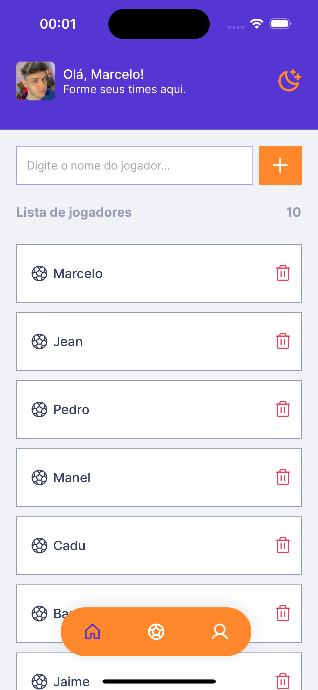
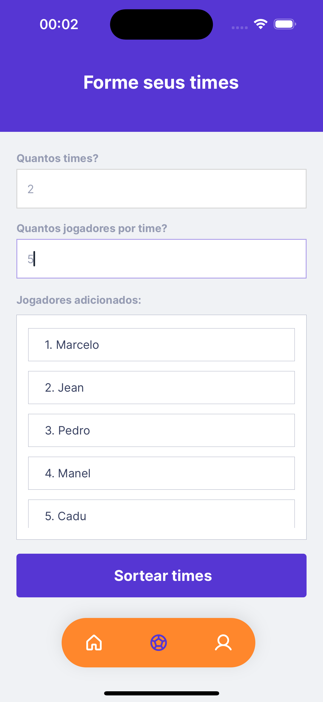
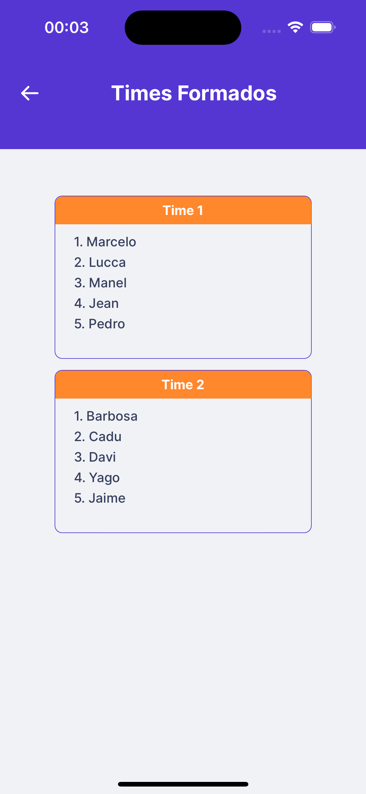
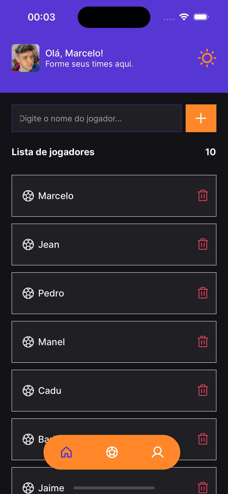
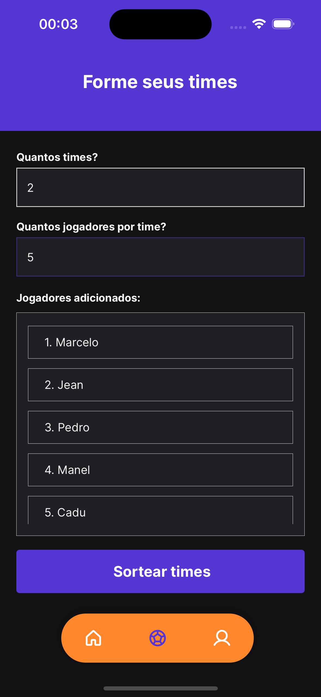
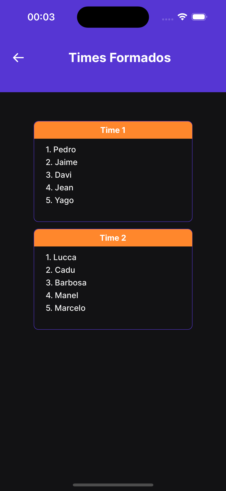

<h1 style="text-align: center; font-weight: bold;">Teams Manager</h1>

## Sobre o Projeto

O teams manager é o app perfeito para sortear seus times na pelada!

### Tecnologias Usadas

- [React Native](https://reactnative.dev/)
- [Expo](https://expo.dev/)
- [TypeScript](https://www.typescriptlang.org/)
- [Styled Components](https://styled-components.com/)
- [Native Base](https://nativebase.io/)
- [Axios](https://axios-http.com/ptbr/docs/intro)
- [React Router](https://reactrouter.com/en/main)
- [React Hook Form](https://react-hook-form.com/)
- [Async Storage](https://reactnative.dev/docs/asyncstorage)

### Como rodar a aplicação

```bash
# Clone este repositório
$ git clone https://github.com/marrcelosantana/teams-manager
# Acesse a pasta do projeto
$ cd teams-manager
# Instale as dependências
$ npm install
# Execute a aplicação em modo de desenvolvimento
$ expo start

```

## Imagens - Tema Light

|                         Login                         |                         Home                         |                          Register                          | Teams                                             |
| :---------------------------------------------------: | :--------------------------------------------------: | :--------------------------------------------------------: | ------------------------------------------------- |
|  |  |  |  |

## Imagens - Tema Dark

|                         Login                         |                        Home                         |                         Register                          | Teams                                            |
| :---------------------------------------------------: | :-------------------------------------------------: | :-------------------------------------------------------: | ------------------------------------------------ |
|  |  |  |  |
